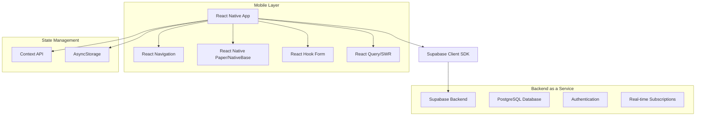
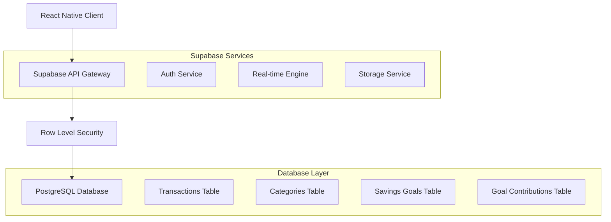
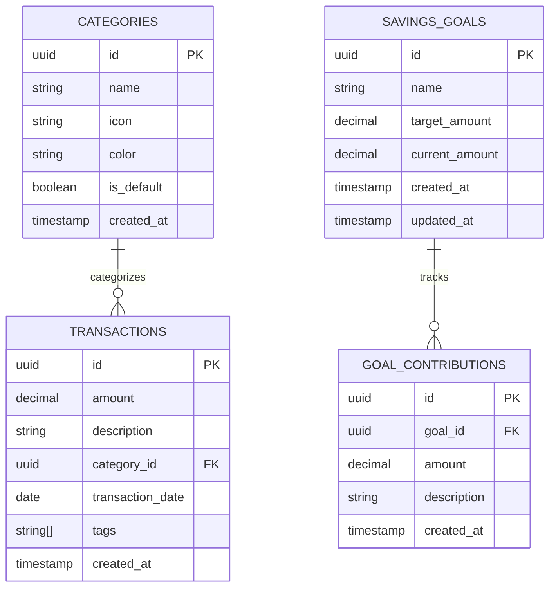

# DeltaFin v1.0 - Documento de Arquitetura Técnica

## 1. Arquitetura do Sistema



## 2. Descrição das Tecnologias

- **Frontend**: React Native@0.72 + TypeScript@5.0
- **UI Library**: React Native Paper@5.0 ou NativeBase@3.4
- **Navegação**: React Navigation@6.0
- **Formulários**: React Hook Form@7.0
- **Estado Global**: Context API + useReducer
- **Cache Local**: AsyncStorage
- **Backend**: Supabase (PostgreSQL + Auth + Real-time)
- **Gráficos**: Victory Native@36.0

## 3. Definições de Rotas

| Rota | Propósito |
|------|-----------|
| /dashboard | Tela principal com saldo, resumo mensal e gráficos |
| /transaction | Formulário para adicionar/editar transações |
| /history | Lista completa de transações com filtros |
| /goals | Gerenciamento de metas de poupança |
| /categories | Gerenciamento de categorias personalizadas |

## 4. Definições de API

### 4.1 APIs Principais

**Transações**
```
GET /rest/v1/transactions
POST /rest/v1/transactions
PUT /rest/v1/transactions?id=eq.{id}
DELETE /rest/v1/transactions?id=eq.{id}
```

Requisição (POST):
| Nome do Parâmetro | Tipo | Obrigatório | Descrição |
|-------------------|------|-------------|-----------|
| amount | number | true | Valor da transação (positivo para crédito, negativo para débito) |
| description | string | false | Descrição da transação |
| category_id | uuid | true | ID da categoria |
| date | string | true | Data da transação (ISO 8601) |
| tags | string[] | false | Array de tags |

Resposta:
| Nome do Parâmetro | Tipo | Descrição |
|-------------------|------|-----------|
| id | uuid | ID único da transação |
| amount | number | Valor da transação |
| description | string | Descrição |
| category_id | uuid | ID da categoria |
| date | string | Data da transação |
| created_at | string | Timestamp de criação |

Exemplo:
```json
{
  "amount": -50.00,
  "description": "Almoço no restaurante",
  "category_id": "123e4567-e89b-12d3-a456-426614174000",
  "date": "2025-10-21T12:00:00Z",
  "tags": ["alimentação", "trabalho"]
}
```

**Metas de Poupança**
```
GET /rest/v1/savings_goals
POST /rest/v1/savings_goals
PUT /rest/v1/savings_goals?id=eq.{id}
DELETE /rest/v1/savings_goals?id=eq.{id}
```

**Categorias**
```
GET /rest/v1/categories
POST /rest/v1/categories
PUT /rest/v1/categories?id=eq.{id}
DELETE /rest/v1/categories?id=eq.{id}
```

## 5. Arquitetura do Servidor



## 6. Modelo de Dados

### 6.1 Diagrama do Modelo de Dados



### 6.2 Linguagem de Definição de Dados

**Tabela de Categorias (categories)**
```sql
-- Criar tabela de categorias
CREATE TABLE categories (
    id UUID PRIMARY KEY DEFAULT gen_random_uuid(),
    name VARCHAR(100) NOT NULL,
    icon VARCHAR(50) NOT NULL,
    color VARCHAR(7) NOT NULL,
    is_default BOOLEAN DEFAULT false,
    created_at TIMESTAMP WITH TIME ZONE DEFAULT NOW()
);

-- Criar índices
CREATE INDEX idx_categories_is_default ON categories(is_default);

-- Inserir categorias padrão
INSERT INTO categories (name, icon, color, is_default) VALUES
('Alimentação', 'utensils', '#F59E0B', true),
('Transporte', 'car', '#3B82F6', true),
('Saúde', 'heart', '#EF4444', true),
('Lazer', 'gamepad-2', '#8B5CF6', true),
('Educação', 'book', '#10B981', true),
('Casa', 'home', '#F97316', true),
('Trabalho', 'briefcase', '#6B7280', true),
('Outros', 'more-horizontal', '#9CA3AF', true);

-- Políticas RLS
ALTER TABLE categories ENABLE ROW LEVEL SECURITY;
GRANT SELECT ON categories TO anon;
GRANT ALL PRIVILEGES ON categories TO authenticated;
```

**Tabela de Transações (transactions)**
```sql
-- Criar tabela de transações
CREATE TABLE transactions (
    id UUID PRIMARY KEY DEFAULT gen_random_uuid(),
    amount DECIMAL(10,2) NOT NULL,
    description TEXT,
    category_id UUID REFERENCES categories(id) ON DELETE SET NULL,
    transaction_date DATE NOT NULL DEFAULT CURRENT_DATE,
    tags TEXT[] DEFAULT '{}',
    created_at TIMESTAMP WITH TIME ZONE DEFAULT NOW()
);

-- Criar índices
CREATE INDEX idx_transactions_date ON transactions(transaction_date DESC);
CREATE INDEX idx_transactions_category ON transactions(category_id);
CREATE INDEX idx_transactions_amount ON transactions(amount);

-- Políticas RLS
ALTER TABLE transactions ENABLE ROW LEVEL SECURITY;
GRANT SELECT ON transactions TO anon;
GRANT ALL PRIVILEGES ON transactions TO authenticated;
```

**Tabela de Metas de Poupança (savings_goals)**
```sql
-- Criar tabela de metas
CREATE TABLE savings_goals (
    id UUID PRIMARY KEY DEFAULT gen_random_uuid(),
    name VARCHAR(200) NOT NULL,
    target_amount DECIMAL(10,2) NOT NULL CHECK (target_amount > 0),
    current_amount DECIMAL(10,2) DEFAULT 0 CHECK (current_amount >= 0),
    created_at TIMESTAMP WITH TIME ZONE DEFAULT NOW(),
    updated_at TIMESTAMP WITH TIME ZONE DEFAULT NOW()
);

-- Criar índices
CREATE INDEX idx_savings_goals_created_at ON savings_goals(created_at DESC);

-- Trigger para atualizar updated_at
CREATE OR REPLACE FUNCTION update_updated_at_column()
RETURNS TRIGGER AS $$
BEGIN
    NEW.updated_at = NOW();
    RETURN NEW;
END;
$$ language 'plpgsql';

CREATE TRIGGER update_savings_goals_updated_at 
    BEFORE UPDATE ON savings_goals 
    FOR EACH ROW EXECUTE FUNCTION update_updated_at_column();

-- Políticas RLS
ALTER TABLE savings_goals ENABLE ROW LEVEL SECURITY;
GRANT SELECT ON savings_goals TO anon;
GRANT ALL PRIVILEGES ON savings_goals TO authenticated;
```

**Tabela de Contribuições para Metas (goal_contributions)**
```sql
-- Criar tabela de contribuições
CREATE TABLE goal_contributions (
    id UUID PRIMARY KEY DEFAULT gen_random_uuid(),
    goal_id UUID REFERENCES savings_goals(id) ON DELETE CASCADE,
    amount DECIMAL(10,2) NOT NULL CHECK (amount > 0),
    description TEXT,
    created_at TIMESTAMP WITH TIME ZONE DEFAULT NOW()
);

-- Criar índices
CREATE INDEX idx_goal_contributions_goal_id ON goal_contributions(goal_id);
CREATE INDEX idx_goal_contributions_created_at ON goal_contributions(created_at DESC);

-- Trigger para atualizar current_amount na meta
CREATE OR REPLACE FUNCTION update_goal_current_amount()
RETURNS TRIGGER AS $$
BEGIN
    IF TG_OP = 'INSERT' THEN
        UPDATE savings_goals 
        SET current_amount = current_amount + NEW.amount
        WHERE id = NEW.goal_id;
        RETURN NEW;
    ELSIF TG_OP = 'DELETE' THEN
        UPDATE savings_goals 
        SET current_amount = current_amount - OLD.amount
        WHERE id = OLD.goal_id;
        RETURN OLD;
    END IF;
    RETURN NULL;
END;
$$ language 'plpgsql';

CREATE TRIGGER trigger_update_goal_amount
    AFTER INSERT OR DELETE ON goal_contributions
    FOR EACH ROW EXECUTE FUNCTION update_goal_current_amount();

-- Políticas RLS
ALTER TABLE goal_contributions ENABLE ROW LEVEL SECURITY;
GRANT SELECT ON goal_contributions TO anon;
GRANT ALL PRIVILEGES ON goal_contributions TO authenticated;
```

## 7. Configuração de Ambiente

### 7.1 Variáveis de Ambiente (.env)

```env
# Supabase Configuration
SUPABASE_URL=your_supabase_project_url
SUPABASE_ANON_KEY=your_supabase_anon_key

# App Configuration
APP_NAME=DeltaFin
APP_VERSION=1.0.0
```

### 7.2 Arquivo de Exemplo (.env.example)

```env
# Supabase Configuration
SUPABASE_URL=https://your-project.supabase.co
SUPABASE_ANON_KEY=your_anon_key_here

# App Configuration
APP_NAME=DeltaFin
APP_VERSION=1.0.0
```