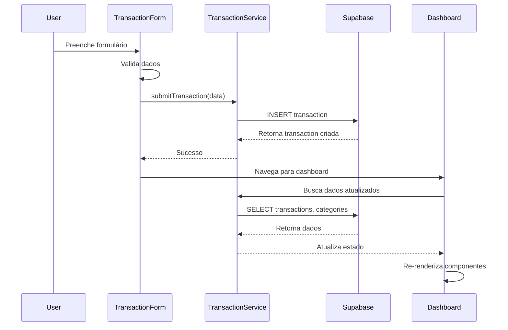
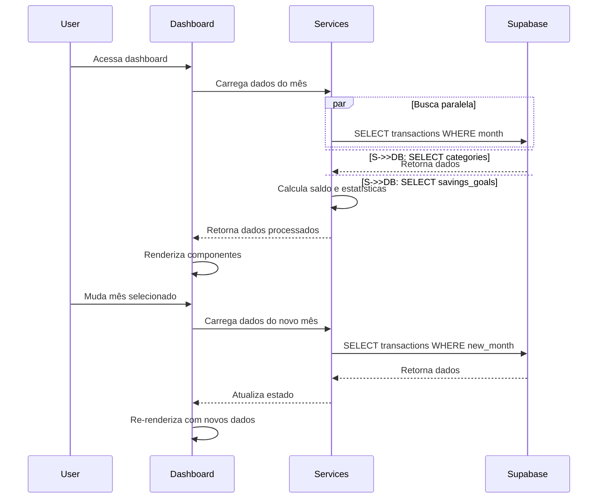
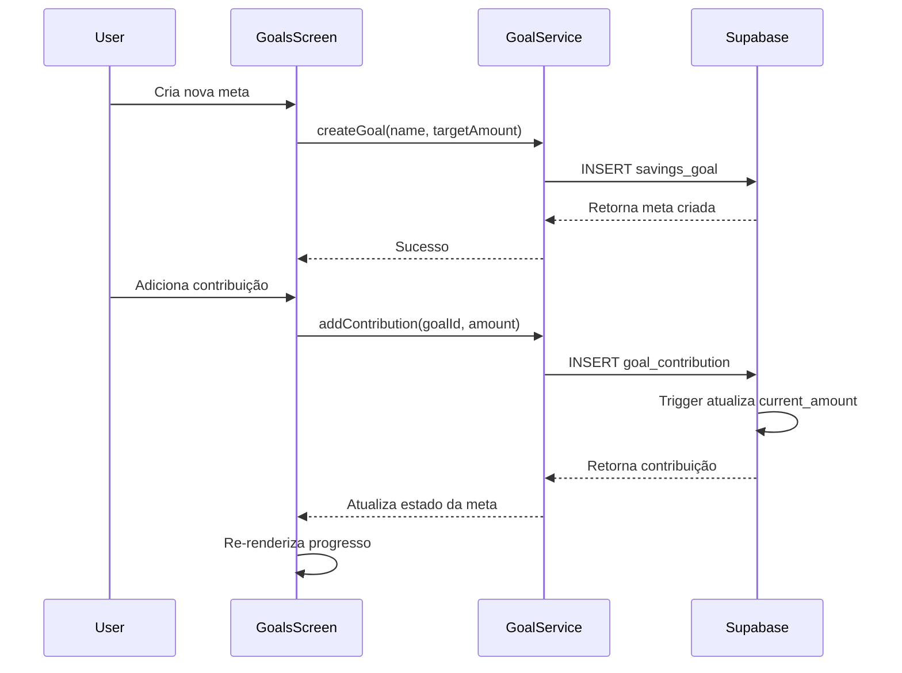

# DeltaFin v1.0 - Especificações de Componentes e Fluxos

## 1. Estrutura de Componentes

### 1.1 Hierarquia de Componentes

```
App
├── Navigation
│   ├── TabNavigator
│   └── StackNavigator
├── Screens
│   ├── DashboardScreen
│   ├── TransactionScreen
│   ├── HistoryScreen
│   ├── GoalsScreen
│   └── CategoriesScreen
├── Components
│   ├── UI
│   │   ├── Button
│   │   ├── Card
│   │   ├── Input
│   │   ├── Modal
│   │   └── LoadingSpinner
│   ├── Charts
│   │   ├── PieChart
│   │   └── ProgressBar
│   ├── Forms
│   │   ├── TransactionForm
│   │   ├── GoalForm
│   │   └── CategoryForm
│   └── Lists
│       ├── TransactionList
│       ├── GoalList
│       └── CategoryList
└── Services
    ├── SupabaseClient
    ├── TransactionService
    ├── GoalService
    └── CategoryService
```

### 1.2 Componentes Principais

#### DashboardScreen
```typescript
interface DashboardProps {
  selectedMonth: Date;
  onMonthChange: (month: Date) => void;
}

// Responsabilidades:
// - Exibir saldo consolidado
// - Mostrar resumo mensal (receitas/despesas)
// - Renderizar gráfico de categorias
// - Listar transações recentes
// - Navegação entre meses
```

#### TransactionForm
```typescript
interface TransactionFormProps {
  transaction?: Transaction;
  onSubmit: (data: TransactionData) => void;
  onCancel: () => void;
}

interface TransactionData {
  amount: number;
  description?: string;
  categoryId: string;
  date: Date;
  tags: string[];
  type: 'credit' | 'debit';
}

// Responsabilidades:
// - Toggle entre débito/crédito
// - Validação de formulário
// - Seleção de categoria
// - Gerenciamento de tags
// - Seleção de data
```

#### PieChart
```typescript
interface PieChartProps {
  data: CategoryExpense[];
  colors: string[];
  showLegend?: boolean;
}

interface CategoryExpense {
  categoryName: string;
  amount: number;
  percentage: number;
  color: string;
}

// Responsabilidades:
// - Renderizar gráfico de pizza
// - Calcular percentuais
// - Exibir legenda
// - Animações suaves
```

## 2. Fluxos de Dados

### 2.1 Fluxo de Adição de Transação



### 2.2 Fluxo de Visualização do Dashboard



### 2.3 Fluxo de Gerenciamento de Metas



## 3. Gerenciamento de Estado

### 3.1 Context API Structure

```typescript
// AppContext.tsx
interface AppState {
  user: User | null;
  selectedMonth: Date;
  transactions: Transaction[];
  categories: Category[];
  goals: SavingsGoal[];
  loading: boolean;
  error: string | null;
}

interface AppActions {
  setSelectedMonth: (month: Date) => void;
  addTransaction: (transaction: Transaction) => void;
  updateTransaction: (id: string, updates: Partial<Transaction>) => void;
  deleteTransaction: (id: string) => void;
  addGoal: (goal: SavingsGoal) => void;
  updateGoal: (id: string, updates: Partial<SavingsGoal>) => void;
  addContribution: (goalId: string, contribution: GoalContribution) => void;
  setLoading: (loading: boolean) => void;
  setError: (error: string | null) => void;
}
```

### 3.2 Hooks Customizados

```typescript
// useTransactions.ts
export const useTransactions = (month?: Date) => {
  const { transactions, addTransaction, updateTransaction, deleteTransaction } = useAppContext();
  
  const monthlyTransactions = useMemo(() => {
    if (!month) return transactions;
    return transactions.filter(t => isSameMonth(t.transaction_date, month));
  }, [transactions, month]);
  
  const totalIncome = useMemo(() => 
    monthlyTransactions
      .filter(t => t.amount > 0)
      .reduce((sum, t) => sum + t.amount, 0)
  , [monthlyTransactions]);
  
  const totalExpenses = useMemo(() => 
    monthlyTransactions
      .filter(t => t.amount < 0)
      .reduce((sum, t) => sum + Math.abs(t.amount), 0)
  , [monthlyTransactions]);
  
  const balance = totalIncome - totalExpenses;
  
  return {
    transactions: monthlyTransactions,
    totalIncome,
    totalExpenses,
    balance,
    addTransaction,
    updateTransaction,
    deleteTransaction
  };
};

// useCategories.ts
export const useCategories = () => {
  const { categories } = useAppContext();
  
  const defaultCategories = categories.filter(c => c.is_default);
  const customCategories = categories.filter(c => !c.is_default);
  
  return {
    categories,
    defaultCategories,
    customCategories
  };
};

// useGoals.ts
export const useGoals = () => {
  const { goals, addGoal, updateGoal, addContribution } = useAppContext();
  
  const activeGoals = goals.filter(g => g.current_amount < g.target_amount);
  const completedGoals = goals.filter(g => g.current_amount >= g.target_amount);
  
  return {
    goals,
    activeGoals,
    completedGoals,
    addGoal,
    updateGoal,
    addContribution
  };
};
```

## 4. Configurações de Performance

### 4.1 Otimizações de Renderização

```typescript
// Memoização de componentes pesados
const PieChart = React.memo(({ data, colors }: PieChartProps) => {
  // Implementação do gráfico
});

const TransactionList = React.memo(({ transactions }: TransactionListProps) => {
  // Lista virtualizada para muitas transações
});

// Debounce para filtros
const useDebounce = (value: string, delay: number) => {
  const [debouncedValue, setDebouncedValue] = useState(value);
  
  useEffect(() => {
    const handler = setTimeout(() => {
      setDebouncedValue(value);
    }, delay);
    
    return () => clearTimeout(handler);
  }, [value, delay]);
  
  return debouncedValue;
};
```

### 4.2 Cache e Persistência

```typescript
// AsyncStorage para cache local
const CacheService = {
  async saveTransactions(transactions: Transaction[]) {
    await AsyncStorage.setItem('transactions', JSON.stringify(transactions));
  },
  
  async loadTransactions(): Promise<Transaction[]> {
    const data = await AsyncStorage.getItem('transactions');
    return data ? JSON.parse(data) : [];
  },
  
  async saveCategories(categories: Category[]) {
    await AsyncStorage.setItem('categories', JSON.stringify(categories));
  },
  
  async loadCategories(): Promise<Category[]> {
    const data = await AsyncStorage.getItem('categories');
    return data ? JSON.parse(data) : [];
  }
};
```

## 5. Tratamento de Erros

### 5.1 Error Boundaries

```typescript
class ErrorBoundary extends React.Component<
  { children: React.ReactNode },
  { hasError: boolean; error?: Error }
> {
  constructor(props: { children: React.ReactNode }) {
    super(props);
    this.state = { hasError: false };
  }
  
  static getDerivedStateFromError(error: Error) {
    return { hasError: true, error };
  }
  
  componentDidCatch(error: Error, errorInfo: React.ErrorInfo) {
    console.error('Error caught by boundary:', error, errorInfo);
  }
  
  render() {
    if (this.state.hasError) {
      return <ErrorScreen error={this.state.error} />;
    }
    
    return this.props.children;
  }
}
```

### 5.2 Validações de Formulário

```typescript
const transactionSchema = z.object({
  amount: z.number().min(0.01, 'Valor deve ser maior que zero'),
  description: z.string().max(200, 'Descrição muito longa'),
  categoryId: z.string().uuid('Categoria inválida'),
  date: z.date().max(new Date(), 'Data não pode ser futura'),
  tags: z.array(z.string()).max(5, 'Máximo 5 tags')
});

export const useTransactionForm = () => {
  const {
    control,
    handleSubmit,
    formState: { errors, isValid }
  } = useForm<TransactionData>({
    resolver: zodResolver(transactionSchema)
  });
  
  return { control, handleSubmit, errors, isValid };
};
```

## 6. Testes e Qualidade

### 6.1 Estrutura de Testes

```typescript
// __tests__/components/TransactionForm.test.tsx
describe('TransactionForm', () => {
  it('should validate required fields', async () => {
    render(<TransactionForm onSubmit={jest.fn()} onCancel={jest.fn()} />);
    
    fireEvent.press(screen.getByText('Salvar'));
    
    await waitFor(() => {
      expect(screen.getByText('Valor deve ser maior que zero')).toBeVisible();
    });
  });
  
  it('should submit valid transaction', async () => {
    const onSubmit = jest.fn();
    render(<TransactionForm onSubmit={onSubmit} onCancel={jest.fn()} />);
    
    fireEvent.changeText(screen.getByPlaceholderText('Valor'), '50.00');
    fireEvent.press(screen.getByText('Alimentação'));
    fireEvent.press(screen.getByText('Salvar'));
    
    await waitFor(() => {
      expect(onSubmit).toHaveBeenCalledWith({
        amount: 50.00,
        categoryId: expect.any(String),
        date: expect.any(Date),
        type: 'debit'
      });
    });
  });
});
```

Esta documentação técnica completa fornece todas as especificações necessárias para implementar o DeltaFin v1.0 com React Native e Supabase, mantendo foco na simplicidade, performance e experiência do usuário conforme definido no PRD original.