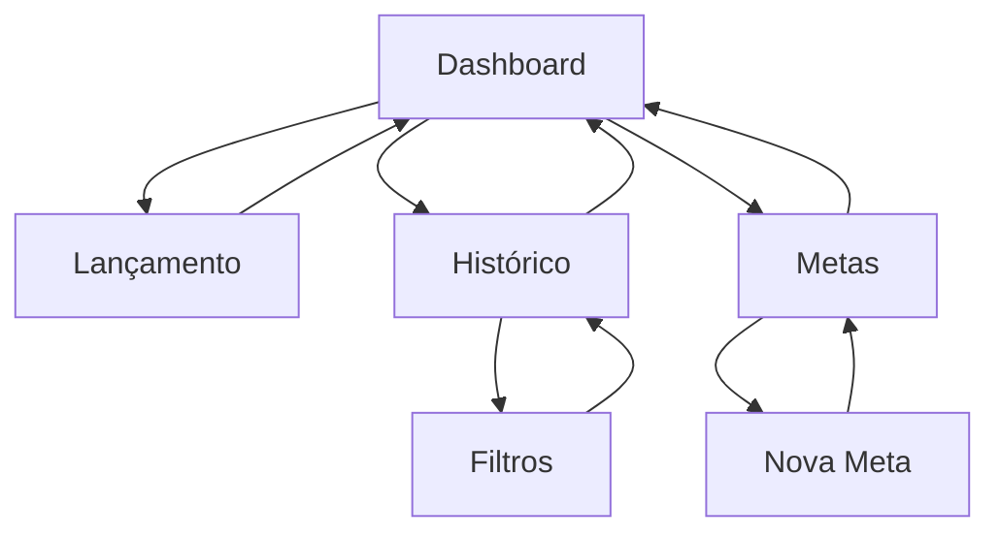

# DeltaFin v1.0 - Documento de Requisitos do Produto

## 1. Visão Geral do Produto

DeltaFin é um aplicativo móvel para gerenciamento financeiro pessoal que oferece uma experiência simples e intuitiva para controle de receitas e despesas. O produto foca na simplicidade, permitindo que usuários registrem transações rapidamente e visualizem seus hábitos financeiros através de dashboards claros.

- **Problema a resolver**: Dificuldade em acompanhar gastos pessoais devido à complexidade das ferramentas existentes
- **Público-alvo**: Jovens adultos e estudantes que buscam simplicidade no controle financeiro
- **Valor do produto**: Transformar o controle financeiro em um hábito simples e visual

## 2. Funcionalidades Principais

### 2.1 Papéis de Usuário

| Papel | Método de Registro | Permissões Principais |
|-------|-------------------|----------------------|
| Usuário | Sem registro necessário | Acesso completo a todas as funcionalidades locais |

### 2.2 Módulos de Funcionalidades

Nossos requisitos consistem nas seguintes páginas principais:

1. **Dashboard (Início)**: saldo consolidado, navegação mensal, gráfico de categorias, transações recentes
2. **Lançamento de Transação**: formulário de débito/crédito, seleção de categorias, tags e observações
3. **Histórico**: visualização completa de transações com filtros
4. **Metas**: criação e acompanhamento de objetivos de poupança

### 2.3 Detalhes das Páginas

| Nome da Página | Nome do Módulo | Descrição da Funcionalidade |
|----------------|----------------|----------------------------|
| Dashboard | Saldo Consolidado | Exibir saldo total atual da conta do usuário |
| Dashboard | Resumo Mensal | Mostrar total de receitas e despesas do mês selecionado |
| Dashboard | Navegação Temporal | Permitir seleção de mês/ano para visualizar períodos anteriores |
| Dashboard | Gráfico de Categorias | Exibir distribuição de despesas por categoria em gráfico pizza |
| Dashboard | Transações Recentes | Listar últimas 5-10 transações para acesso rápido |
| Lançamento | Formulário de Transação | Registrar débitos e créditos com valor, data, categoria |
| Lançamento | Sistema de Categorias | Selecionar categoria padrão ou criar categoria personalizada |
| Lançamento | Tags e Observações | Adicionar tags opcionais e campo de observação livre |
| Histórico | Lista de Transações | Visualizar todas as transações com paginação |
| Histórico | Filtros | Filtrar por data, categoria, tipo (débito/crédito) e tags |
| Metas | Criação de Metas | Criar objetivos de poupança com nome e valor-alvo |
| Metas | Acompanhamento | Visualizar progresso das metas com alimentação manual |
| Metas | Gerenciamento | Editar ou excluir metas existentes |

## 3. Processo Principal

### Fluxo do Usuário Principal

O usuário inicia no dashboard onde visualiza seu saldo atual e resumo mensal. Para adicionar uma transação, navega para a tela de lançamento, preenche os dados (valor, categoria, data) e salva. O sistema atualiza automaticamente o saldo e os gráficos. Para acompanhar objetivos, o usuário cria metas na tela específica e alimenta manualmente o progresso conforme economiza.

### Fluxo de Navegação

## 4. Design da Interface

### 4.1 Estilo de Design

- **Cores primárias**: Verde (#22C55E) para créditos, Vermelho (#EF4444) para débitos
- **Cores secundárias**: Azul (#3B82F6) para elementos de navegação, Cinza (#6B7280) para textos secundários
- **Estilo de botões**: Arredondados com bordas suaves (border-radius: 12px)
- **Tipografia**: Inter ou similar, tamanhos 14px (corpo), 18px (títulos), 24px (valores)
- **Layout**: Design card-based com espaçamento generoso, navegação bottom tab
- **Ícones**: Outline style, consistentes com a biblioteca Lucide ou Feather

### 4.2 Visão Geral do Design das Páginas

| Nome da Página | Nome do Módulo | Elementos da UI |
|----------------|----------------|-----------------|
| Dashboard | Saldo Consolidado | Card principal com valor em destaque, cor verde/vermelha baseada no saldo |
| Dashboard | Resumo Mensal | Cards lado a lado mostrando receitas (verde) e despesas (vermelho) |
| Dashboard | Gráfico de Categorias | Gráfico de pizza colorido com legenda, cores distintas por categoria |
| Lançamento | Formulário | Toggle débito/crédito, input de valor, seletor de data, dropdown de categorias |
| Histórico | Lista | Cards de transação com ícone da categoria, valor colorido, data |
| Metas | Cards de Progresso | Barra de progresso, valor atual vs. objetivo, botão de alimentação |

### 4.3 Responsividade

O aplicativo é mobile-first, otimizado para telas de 375px a 428px de largura. Interface touch-friendly com botões de pelo menos 44px de altura. Suporte a orientação portrait prioritariamente, com adaptação básica para landscape.