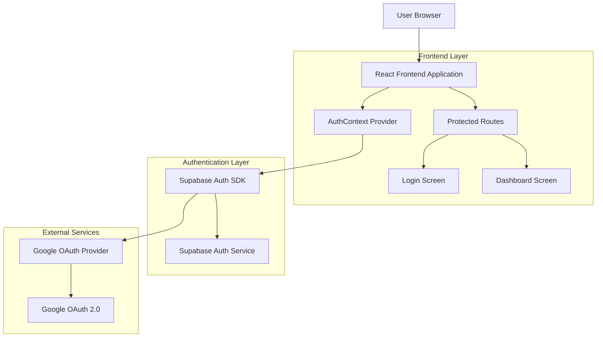
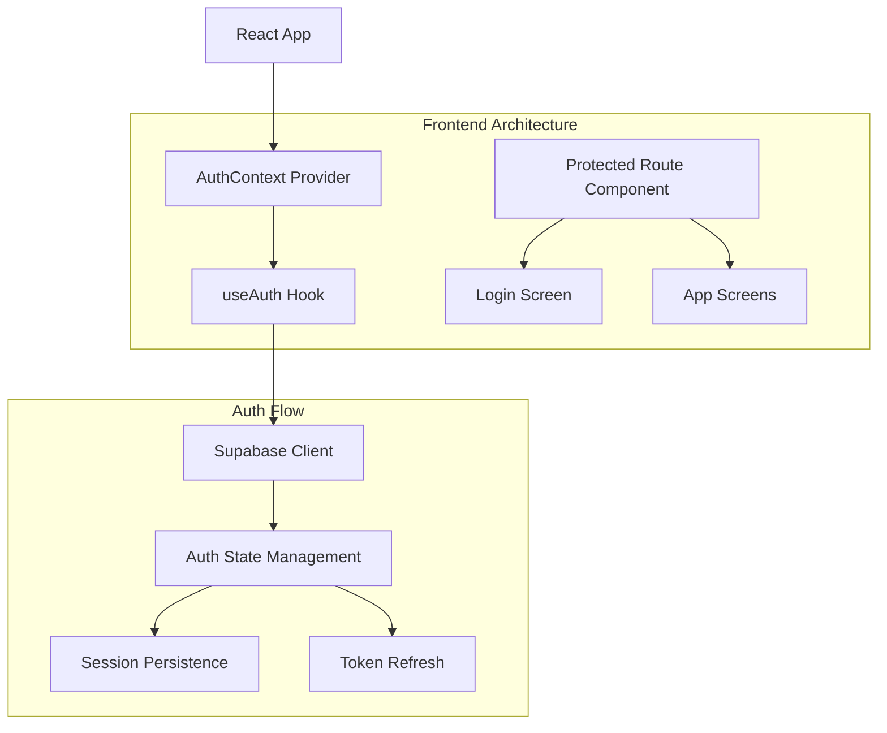
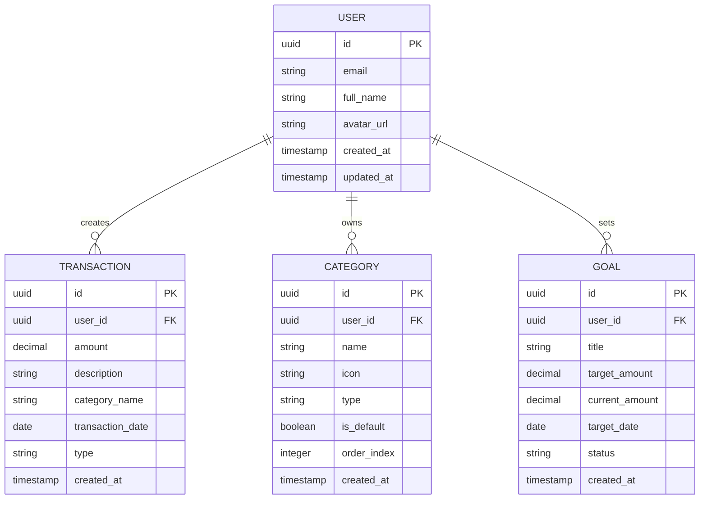

# DeltaFin - Arquitetura do Sistema de Autenticação
## Documento de Arquitetura Técnica v1.0

## 1. Architecture design



## 2. Technology Description

- **Frontend**: React@18 + TypeScript + Tailwind CSS@3 + Vite
- **Authentication**: Supabase Auth + Google OAuth 2.0
- **State Management**: React Context + useReducer (AuthContext)
- **Routing**: React Router DOM@7 com proteção de rotas
- **HTTP Client**: Supabase SDK (built-in)

## 3. Route definitions

| Route | Purpose | Protection |
|-------|---------|------------|
| /login | Tela de autenticação via Google | Público (redireciona se já autenticado) |
| / | Dashboard principal | Protegido |
| /transaction | Tela de lançamento de transações | Protegido |
| /history | Histórico de transações | Protegido |
| /goals | Metas financeiras | Protegido |
| /categories | Gerenciamento de categorias | Protegido |
| /profile | Perfil do usuário | Protegido |

## 4. API definitions

### 4.1 Core Authentication API

**Supabase Auth Methods**

Login via Google OAuth:
```typescript
const { data, error } = await supabase.auth.signInWithOAuth({
  provider: 'google',
  options: {
    redirectTo: `${window.location.origin}/`
  }
})
```

Logout:
```typescript
const { error } = await supabase.auth.signOut()
```

Get Current Session:
```typescript
const { data: { session } } = await supabase.auth.getSession()
```

Listen to Auth Changes:
```typescript
supabase.auth.onAuthStateChange((event, session) => {
  // Handle auth state changes
})
```

### 4.2 TypeScript Types

```typescript
// Auth Context Types
interface AuthState {
  user: User | null;
  session: Session | null;
  loading: boolean;
  error: string | null;
}

interface AuthContextType {
  user: User | null;
  session: Session | null;
  loading: boolean;
  error: string | null;
  signInWithGoogle: () => Promise<void>;
  signOut: () => Promise<void>;
  clearError: () => void;
}

// Supabase User Type
interface User {
  id: string;
  email: string;
  user_metadata: {
    avatar_url?: string;
    full_name?: string;
    name?: string;
  };
  created_at: string;
}
```

## 5. Server architecture diagram



## 6. Data model

### 6.1 Data model definition



### 6.2 Data Definition Language

**User Profile Extension (users table)**
```sql
-- Extend existing users table for profile data
ALTER TABLE auth.users ADD COLUMN IF NOT EXISTS full_name TEXT;
ALTER TABLE auth.users ADD COLUMN IF NOT EXISTS avatar_url TEXT;

-- Create user profiles table for additional data
CREATE TABLE IF NOT EXISTS public.user_profiles (
    id UUID PRIMARY KEY REFERENCES auth.users(id) ON DELETE CASCADE,
    full_name TEXT,
    avatar_url TEXT,
    created_at TIMESTAMP WITH TIME ZONE DEFAULT NOW(),
    updated_at TIMESTAMP WITH TIME ZONE DEFAULT NOW()
);

-- Enable RLS
ALTER TABLE public.user_profiles ENABLE ROW LEVEL SECURITY;

-- Create policies
CREATE POLICY "Users can view own profile" ON public.user_profiles
    FOR SELECT USING (auth.uid() = id);

CREATE POLICY "Users can update own profile" ON public.user_profiles
    FOR UPDATE USING (auth.uid() = id);

CREATE POLICY "Users can insert own profile" ON public.user_profiles
    FOR INSERT WITH CHECK (auth.uid() = id);
```

**Update existing tables with user_id**
```sql
-- Add user_id to existing tables if not present
ALTER TABLE transactions ADD COLUMN IF NOT EXISTS user_id UUID REFERENCES auth.users(id);
ALTER TABLE categories ADD COLUMN IF NOT EXISTS user_id UUID REFERENCES auth.users(id);
ALTER TABLE savings_goals ADD COLUMN IF NOT EXISTS user_id UUID REFERENCES auth.users(id);

-- Update RLS policies for user isolation
DROP POLICY IF EXISTS "Users can view own transactions" ON transactions;
CREATE POLICY "Users can view own transactions" ON transactions
    FOR SELECT USING (auth.uid() = user_id);

DROP POLICY IF EXISTS "Users can insert own transactions" ON transactions;
CREATE POLICY "Users can insert own transactions" ON transactions
    FOR INSERT WITH CHECK (auth.uid() = user_id);

DROP POLICY IF EXISTS "Users can update own transactions" ON transactions;
CREATE POLICY "Users can update own transactions" ON transactions
    FOR UPDATE USING (auth.uid() = user_id);

DROP POLICY IF EXISTS "Users can delete own transactions" ON transactions;
CREATE POLICY "Users can delete own transactions" ON transactions
    FOR DELETE USING (auth.uid() = user_id);

-- Similar policies for categories and goals
DROP POLICY IF EXISTS "Users can view own categories" ON categories;
CREATE POLICY "Users can view own categories" ON categories
    FOR SELECT USING (auth.uid() = user_id OR user_id IS NULL);

DROP POLICY IF EXISTS "Users can manage own categories" ON categories;
CREATE POLICY "Users can manage own categories" ON categories
    FOR ALL USING (auth.uid() = user_id);
```

**Environment Variables Setup**
```bash
# Add to .env
VITE_SUPABASE_URL=https://your-project.supabase.co
VITE_SUPABASE_ANON_KEY=your_anon_key_here

# Supabase Dashboard Configuration Required:
# 1. Enable Google OAuth provider
# 2. Configure redirect URLs:
#    - http://localhost:5173 (development)
#    - https://your-domain.com (production)
# 3. Set Google OAuth credentials (Client ID & Secret)
```

**Google OAuth Configuration Steps**
1. **Google Cloud Console**:
   - Create new project or use existing
   - Enable Google+ API
   - Create OAuth 2.0 credentials
   - Add authorized redirect URIs

2. **Supabase Dashboard**:
   - Go to Authentication > Providers
   - Enable Google provider
   - Add Google Client ID and Secret
   - Configure redirect URLs

3. **Application Setup**:
   - Install dependencies (already present)
   - Configure environment variables
   - Implement AuthContext and components